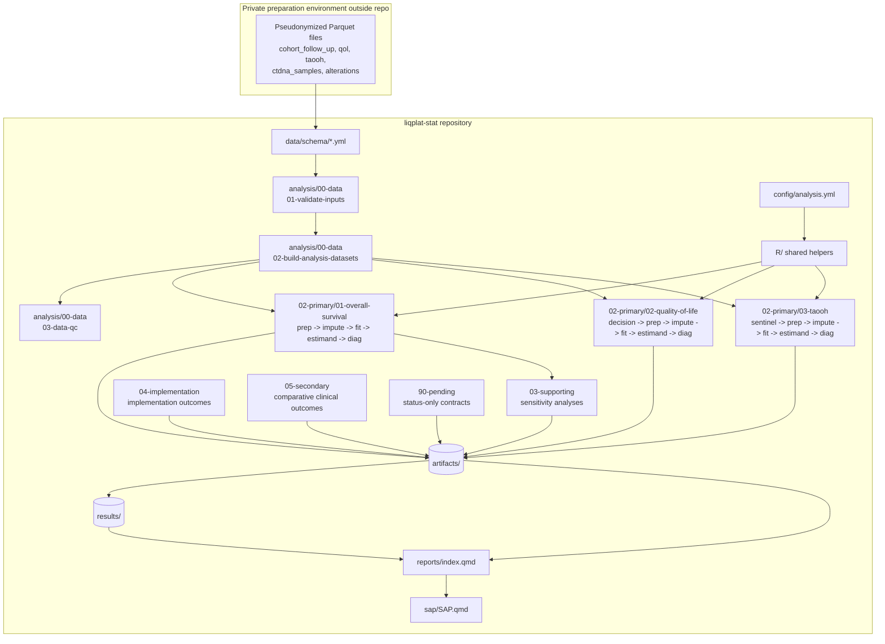

# LIQPLAT Statistical Analysis Pipeline — Architecture

## Overview

This repository holds the public, reproducible analysis pipeline and the
Statistical Analysis Plan (SAP) for **LIQPLAT**, a random-invitation single-arm
trial (SAT) at University Hospital Basel that evaluates the implementation of
ctDNA in routine cancer care. Patients are randomly selected for invitation
from a prospective research registry; the randomized comparison treats
*selection for invitation* as the intervention, with an external usual-care
comparator drawn from eligible patients who were considered but not selected.
Outcome data come almost exclusively from routinely collected electronic
health records mirrored in the clinical data warehouse (CDWH) and REDCap.

The pipeline is **source-oriented and reproducible**: it contains code, YAML
schemas, and version-controlled artifacts only — no clinical data or direct
identifiers.

Three primary endpoints are analysed in a Bayesian framework:

- **Overall Survival (OS)** — restricted mean survival time (RMST) through
  day 182, fitted with a proportional-hazards model.
- **Quality of Life (QoL)** — longitudinal patient-reported global QoL, using
  an ordinal transition (Markov) model on a principal stratum (or the
  prespecified death-inclusive fallback).
- **Time Alive and Out of Hospital (TAOOH)** — time alive and out of hospital
  over 26 weeks, using a second-order ordinal Markov model with random
  intercepts.

## Architecture Diagram

The runner (`scripts/run-all.R`) drives this flow, reading stage order and
paths only from `config/stages.yml`. A failed stage stops the run. Per-stage
outputs are checkpointed so expensive imputation/model loops resume from the
first missing branch.

## Pipeline Orchestration

### Stage registry

`config/stages.yml` is the **sole ordered registry** of executable stages. The
runner never discovers Quarto documents from the directory tree. Each entry
has a unique `id`, a numeric `number` (must be strictly increasing), a relative
`path`, and a `description`. The registry covers data validation/derivation,
population description, the three primary endpoint chains, supporting
sensitivity analyses, implementation outcomes, secondary outcomes, pending
status-only contracts, and the final report/SAP.

### Runner

`scripts/run-all.R` is a small explicit-orchestration script:

- Enforces exactly R 4.6.1 (in `main()`).
- Loads and validates the registry via `load_stage_registry()`.
- Resolves `--from`/`--to` by one-based index or stage id.
- Renders each selected stage with `quarto render <path>` through
  `render_stage()`.
- Sets `LIQPLAT_FORCE=1` when `--force` is passed, so stage checkpoints are
  re-created rather than skipped.

Because an expensive stage may create many per-imputation files, most stage
notebooks keep their own re-entry logic: they skip a branch when its output
already exists and only regenerate the first missing one. `--force` disables
this skip.

### Quarto project

`_quarto.yml` defines the project with `output-dir: _site`, freezes execution,
and lists `sap/` and `reports/` as resources so the default project does not
implicitly render every analysis notebook. Analysis notebooks are rendered
explicitly by `scripts/run-all.R`.

### Environment and smoke tests

- `scripts/check-environment.R` — confirms the exact R version, Quarto, the
  required packages, and (with `--strict`) the approved `markov.misc`
  provenance.
- `scripts/synthetic-smoke-test.R` — renders the artifact-only report to HTML
  and Typst from a generated synthetic fixture, without fitting Stan models or
  reading `data/private/`.
- `tests/testthat.R` — runs the no-PHI structural/contract suite from
  `tests/testthat/`.

## Configuration and Determinism

### `config/analysis.yml`

All analysis constants live here and are loaded by
`R/analysis-config.R::read_analysis_config()`. Key sections:

- `analysis` — name, `config_version`, `data_lock` (must be `2026-09-05`),
  and `horizon_days` (must be `182`).
- `imputation` — main (`m = 50`, `maxit = 50`, `donors = 5`) and supporting
  (`indices 1:5`, `m = 5`, `post_estimation_draws = 500`) settings.
- `markov` — chains (4), iterations (1000), warmup (500), retry_iterations
  (2000), and `post_estimation_draws` (200), plus the first/second-order
  variable names (`p_var`, `p2_var`).
- `seeds` — named deterministic seed families (`data`, `imputation`, `qol`,
  `taooh`, `survival`, `supporting`, `diagnostics`, `reports`).
- `diagnostics` — sampler thresholds (`max_rhat`, min ESS bulk/tail,
  divergent transitions, treedepth, B-FMI) and retry settings.
- `provenance.markov_misc` — the reviewed clean `markov.misc` version and
  40-hex Git SHA (currently an invalid placeholder until the clean release is
  recorded).
- `paths` — `private_data`, `schema_dir`, `derived_data`, `artifacts`,
  `results`, `reports`, `logs`.

`R/analysis-config.R::validate_analysis_config()` aggressively asserts these
fixed values (e.g. `m = 50`, `maxit = 50`, lock date, horizon, Markov/diagnostic
settings). This prevents an accidental change to the primary-analysis recipe.

### Deterministic seeds

Every stochastic stage derives its seed with `analysis_seed(config, family,
imputation, offset)` (in `R/analysis-config.R`). It is never drawn from the
clock. The seed is `base_seed + (imputation-1)*1000 + offset`, which keeps
per-imputation, per-stage branches reproducible. Imputation branches use
`one_imputation_seed()` in `R/imputation.R` on the same pattern.

## Data Contract and Validation

The public pipeline consumes **pseudonymized Parquet files** only. Each file is
validated against a YAML schema in `data/schema/` before an analysis stage reads
it. The hand-off contains six files, including `recruitment.parquet`
(the dedicated three-column calendar recruitment export):

- `cohort_follow_up.parquet` — single wide participant-level dataset
  (recruitment, follow-up, OS, process, imaging, biopsy, blood-product,
  progression, BSC, MTB).
- `qol.parquet`, `taooh.parquet` — repeated longitudinal observations.
- `ctdna_samples.parquet`, `alterations.parquet` — repeated ctDNA sample and
  alteration records.

`data/README.md` documents the privacy boundary: raw extracts, direct
identifiers, source-system linkage keys, free-text clinical notes, and any
re-identification key stay in the private preparation environment. They must
never be copied into `data/private/`, committed, or written to a report
artifact. `data/private/` is only an ignored local hand-off location.

`R/data-validation.R` enforces the contract:
- `read_data_schema()` / `validate_schema_document()` — validates schema
  structure (name, primary key, per-column type/required/private/unit/coding).
- `validate_data_schema()` — checks column types, requiredness, and primary-key
  uniqueness.
- `assert_pseudonymized_columns()` and `assert_no_phi_columns()` — reject PHI /
  direct-identifier columns using a conservative deny-list that still allows
  the approved pseudonymous `id` and `sample_id`.
- `read_pseudonymized_parquet()` — the single public Parquet input path.

The privacy/readiness gate is repeated in `R/analysis-config.R` (production
preflight) and surfaced in report section rendering by `R/report-reader.R`.

## Shared R Helpers

The `R/` directory holds reusable, testable behaviour. These are sourced by
notebooks (which are not an installed package) and are not a formal export
surface.

| File | Responsibility |
|------|----------------|
| `R/analysis-config.R` | Read/validate `config/analysis.yml`, seed derivation, package provenance. |
| `R/data-helpers.R` | Date parsing, censoring at the fixed lock, exposure construction, missing-vs-zero semantics, `invert_q30()`. |
| `R/data-validation.R` | Schema-aware validation, PHI deny-list, pseudonymized Parquet reader. |
| `R/imputation.R` | Deterministic one-imputation MICE branches and equal-weight draw pooling (`pool_equal_weight_draws`). |
| `R/markov-helpers.R` | Thin auditable wrappers around `markov.misc` (`blrm_markov`, `sops`, `avg_sops`, `avg_comparisons`), diagnostics, and retry. |
| `R/survival-helpers.R` | mGPS/ECOG derivation, `stan_surv` fitting, standardized survival curves, RMST and risk draws. |
| `R/model-helpers.R` | Posterior summaries, credible intervals, probability of benefit, draw stacking. |
| `R/count-helpers.R` | Bayesian negative-binomial count/rate helpers for secondary analyses. |
| `R/actionability.R` | Implementation-outcome derivations (technical validity, baseline detection, CHIP, actionability, MTB). |
| `R/paths-artifacts.R` | Path construction and recoverable/atomic artifact writers (RDS, Parquet, text). |
| `R/report-reader.R` | Artifact-only report readers; renders status, tables, and figures from `results/` and `artifacts/`. |

The native pipe `|>` and the `here()` package are used throughout. Variables
use `snake_case`.

## Primary Endpoint Analyses

Each primary endpoint is a chain of numbered Quarto stages that flows data from
`analysis/00-data/results/` through per-imputation artifacts into `results/`
and figures in `artifacts/`. Each stage is independently re-runnable.

### Overall Survival (OS)

`analysis/02-primary/01-overall-survival/`

1. `01-preparation.qmd` — selects SAP covariates and derives deterministic
   `ecog_binary` and `mgps` from the wide cohort.
2. `02-imputation.qmd` — runs one MICE run (`m = 50`) with `polr` for ordered
   ECOG, predictive mean matching for continuous labs, passive recalculation
   of `ecog_binary`/`mgps`, and the Nelson-Aalen cumulative hazard as a
   predictor.
3. `03-fitting.qmd` — fits `rstanarm::stan_surv` to each completed dataset: a
   proportional-hazards model with a 5-df M-spline baseline. One intervention
   participant censored on day 0 is excluded from the likelihood but retained
   for estimand prediction.
4. `04-estimand.qmd` — draws 200 standardized survival curves per imputation,
   computes 182-day RMST (trapezoidal rule) and survival risk contrasts, pools
   draws with equal weight, and writes RMST summary, risk summary, curves, and
   follow-up sufficiency.
5. `05-diagnostics.qmd` — posterior diagnostics against `config/analysis.yml`
   thresholds.

The OS estimand decision (66% CrI within [-7, 7] days) controls which QoL
analysis is primary.

### Quality of Life (QoL)

`analysis/02-primary/02-quality-of-life/`

1. `00-analysis-decision.qmd` — applies the prespecified OS RMST rule to select
   the primary analysis (`principal_stratum` vs `death_inclusive_ordinal`) and
   writes the decision to `results/primary/overall-survival/qol-decision.yml`.
   The currently activated stages implement the death-inclusive fallback and
   refuse to run if the OS rule selects principal-stratum.
2. `01-preparation.qmd` — prepares the adjusted death-inclusive six-month QoL
   endpoint.
3. `02-imputation.qmd` — imputes `m = 50` datasets. For censored living
   participants, vital status at day 182 is drawn from a dedicated Bayesian
   survival model; deaths receive state 8, and QoL is imputed only for those
   alive at day 182.
4. `03-fitting.qmd` — fits the adjusted death-inclusive proportional-odds
   models.
5. `04-estimand.qmd` — retains 200 treatment draws per imputation, computes the
   odds ratio for a worse six-month QoL/death state, pools equal draw counts,
   and writes the summary and posterior figure.
6. `05-diagnostics.qmd`, `06-descriptive.qmd`,
   `07-proportional-odds-check.qmd` — diagnostics, descriptive distributions,
   and a proportional-odds check.

### Time Alive and Out of Hospital (TAOOH)

`analysis/02-primary/03-taooh/`

1. `00-no-treatment-sentinel.qmd` — a reduced second-order model (no treatment
   term) that validates the `markov.misc::blrm_markov()` API and the weekly
   data contract (death state 5 is absorbing; censoring after last follow-up)
   before the 50 full fits.
2. `01-preparation.qmd` — prepares the weekly TAOOH endpoint.
3. `02-imputation.qmd` — patient-level baseline-covariate imputations; the
   weekly history is built from observed `y_taooh` before imputation.
4. `03-fitting.qmd` — fits the full proportional-odds second-order model with a
   patient-level random intercept to all 50 imputations, with a retry loop.
5. `04-estimand.qmd` — computes posterior-standardized state occupancy
   probabilities and the intervention-minus-control difference in time alive
   and out of hospital over 26 weeks via `markov.misc::avg_sops()` and
   `avg_comparisons()`, pooling equal draw counts.
6. `05-diagnostics.qmd` — validates posterior diagnostics.

## Supporting, Secondary, Implementation, and Pending Stages

These live under `analysis/03-supporting/`, `analysis/04-implementation/`,
`analysis/05-secondary/`, and `analysis/90-pending/`. Supporting analyses
deliberately use imputation indices `1:5` and 500 post-estimation draws and must
not be described as primary.

- **Supporting** — OS non-proportional-hazards, fixed 26-week death, OS
  unrestricted/potential-follow-up, unadjusted QoL landmark, death-inclusive
  longitudinal QoL, principal-stratum Markov QoL, and TAOOH first-order /
  death-transition sensitivity analyses.
- **Implementation** — invitation offered/accepted, technical validity,
  baseline detection, CHIP, actionability, turnaround, and molecular tumour
  board (MTB) outcomes.
- **Secondary** — progression-free survival, six/12-month survival rates, time
  to best supportive care, blood-product, tissue-biopsy, and imaging outcomes.
- **Pending** — status-only contracts (weekly treatment, next treatment line,
  treatment switch/stop, targeted therapy, trial referral/recruitment,
  physical function) whose source fields are not yet in the approved private
  contract. They are never treated as zero or silently omitted.
- **`analysis/90-pending/`** and the `data/README.md` and `data/VARIABLES.md`
  pending-field conventions keep these contracts honest.

## Reports and the SAP

### Artifact-only report

`reports/index.qmd` is assembled exclusively from compact analysis result and
figure artifacts via `R/report-reader.R`. It never imputes data or fits a model.
A missing artifact is rendered as **not run** or **unavailable**, never as zero
or a completed analysis. The report splits into numbered sections under
`reports/sections/` (population, OS, QoL, TAOOH, supporting, implementation,
secondary, pending, diagnostics).

The report is read-only: `report_render_section()` resolves a
`status.yml`/manifest, renders the status line, then any available table and
figure artifacts. The QoL section additionally reads the OS decision artifact
via `read_qol_analysis_decision()`, so the report never selects a QoL primary
on its own.

### Statistical Analysis Plan

`sap/SAP.qmd` is the final, human-facing output. It aggregates and summarizes
the methods and results defined across the analysis directories, includes the
formal estimand definitions, the ordinal Markov models, missing-data
strategies, and illustrative (non-evaluated) implementation code in its
appendices. It is rendered explicitly (`quarto render sap/SAP.qmd`) and is not
run through the artifact-only pipeline.

## Code References

| Component | File | Key Symbols |
|-----------|------|-------------|
| Orchestration | `config/stages.yml` | `stages` registry (id/number/path) |
| Runner | `scripts/run-all.R` | `main()`, `load_stage_registry()`, `render_stage()`, `resolve_stage_index()` |
| Config | `config/analysis.yml` | `analysis`, `imputation`, `markov`, `seeds`, `diagnostics`, `provenance`, `paths` |
| Config reader | `R/analysis-config.R` | `read_analysis_config()`, `validate_analysis_config()`, `analysis_seed()`, `analysis_preflight()` |
| Data contract | `R/data-validation.R` | `validate_data_schema()`, `assert_pseudonymized_columns()`, `assert_no_phi_columns()`, `read_pseudonymized_parquet()` |
| Data helpers | `R/data-helpers.R` | `parse_analysis_date()`, `censor_at_lock()`, `derive_survival_endpoint()`, `invert_q30()`, `construct_exposure()` |
| Imputation | `R/imputation.R` | `mice_one_imputation()`, `run_mice_branches()`, `pool_equal_weight_draws()` |
| Markov | `R/markov-helpers.R` | `fit_markov_model()`, `markov_diagnostics()`, `fit_markov_with_retry()`, `markov_post_estimation()`, `markov_avg_comparisons()` |
| Survival | `R/survival-helpers.R` | `derive_mgps()`, `derive_ecog_binary()`, `fit_survival_model()`, `posterior_standardized_survival()`, `compute_rmst_draws()` |
| Summaries | `R/model-helpers.R` | `summarize_posterior_draws()`, `posterior_probability()`, `credible_interval()`, `stack_imputation_results()` |
| Counts | `R/count-helpers.R` | `fit_count_model()`, `standardize_count_draws()`, `summarize_count_posterior()` |
| Implementation | `R/actionability.R` | `summarize_actionability()`, `derive_ctdna_technical_validity()`, `summarize_baseline_detection()`, `summarize_mtb_referral()` |
| Artifacts | `R/paths-artifacts.R` | `project_path()`, `assert_artifact_path()`, `write_atomic()`, `write_atomic_parquet()` |
| Report reader | `R/report-reader.R` | `report_section_state()`, `report_render_section()`, `read_qol_analysis_decision()` |
| Smoke test | `scripts/synthetic-smoke-test.R` | `run_synthetic_smoke()` |
| Test entry | `tests/testthat.R` | `test_dir(..., stop_on_failure = TRUE)` |

## Glossary

| Term | Definition |
|------|------------|
| **CDWH** | Clinical Data Warehouse; the source of routine electronic health-record data. |
| **CrI** | Credible Interval; the Bayesian interval reported for a posterior quantity. |
| **ctDNA** | Circulating Tumor DNA; the biomarker being implemented and evaluated. |
| **Estimand** | The target treatment-effect quantity, defined with potential-outcomes notation. |
| **ITT** | Intention-to-Treat; the eligible registry population for the randomized comparison. |
| **mGPS** | modified Glasgow Prognostic Score; derived from albumin and C-reactive protein. |
| **MICE** | Multiple Imputation by Chained Equations; the imputation engine. |
| **PMM** | Predictive Mean Matching; the continuous-variable imputation method. |
| **psATE** | Principal Stratum Average Treatment Effect; the QoL estimand under the principal-stratum assumption. |
| **RMST** | Restricted Mean Survival Time; the 182-day OS estimand. |
| **SAT** | Single-Arm Trial. |
| **SOP** | State Occupancy Probability; the probability of being in a given ordinal state at a given time. |
| **TAOOH** | Time Alive and Out of Hospital; the 26-week ordinal Markov endpoint. |
| **UC** | Usual Care; the external comparator (not selected for invitation). |
